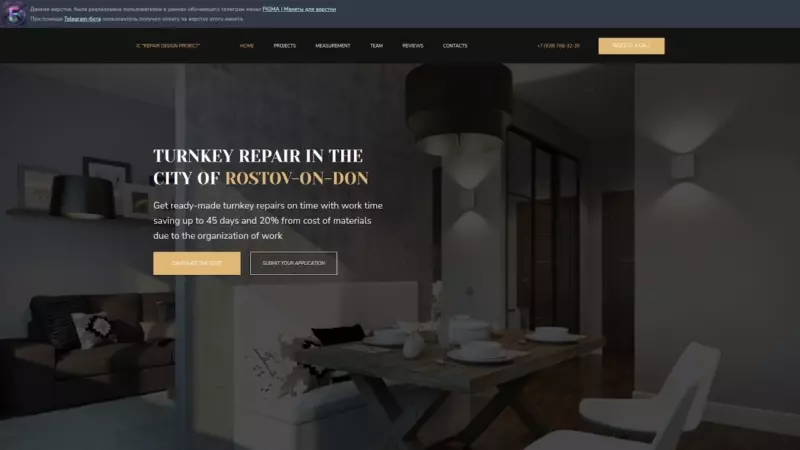
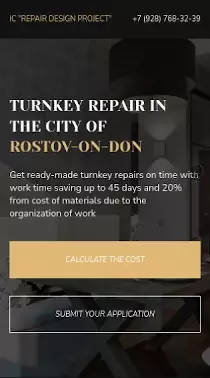
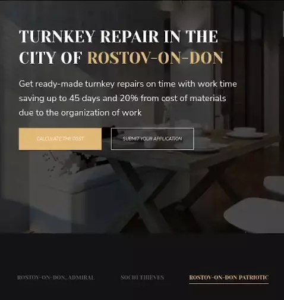

# Repaire Landing

### Use Skills

---

[Demo Link  ](https://golovanovalex.github.io/Repaire_Landing/)

## Info

Источник макета Telegram-канал [FIGMA | Макеты для верстки](https://t.me/+oXZSKMmXp6UyOGI6)

Данная верстка, была реализована пользователем.  
Работа с **HTML**, **CSS** и **JS**.  
Использование препроцессинга **SASS**, модуль гибкого контейнера **Flexbox**, сборщика **Gulp**. Слайдера **Swiper**.  
Пройдена валидация HTML и CSS.

При помощи Telegram-бота [FIGMA | 💵 Верстай за деньги](https://t.me/HtmlCodeForMoney_bot) получил оплату за верстку этого макета.

---

Респонсивный дизайн адаптирует сайт под любой экран устройства.

 &nbsp;&nbsp;&nbsp;&nbsp;&nbsp;&nbsp;&nbsp;

---

## Contacts

- 📧 My Email: <a href="mailto:golovanov.a.a@yandex.ru" >Golovanov.a.a@yandex.ru</a>
- 📜 My Website: [alexgolovanov.ru](http://alexgolovanov.ru)

 Made with 💙
